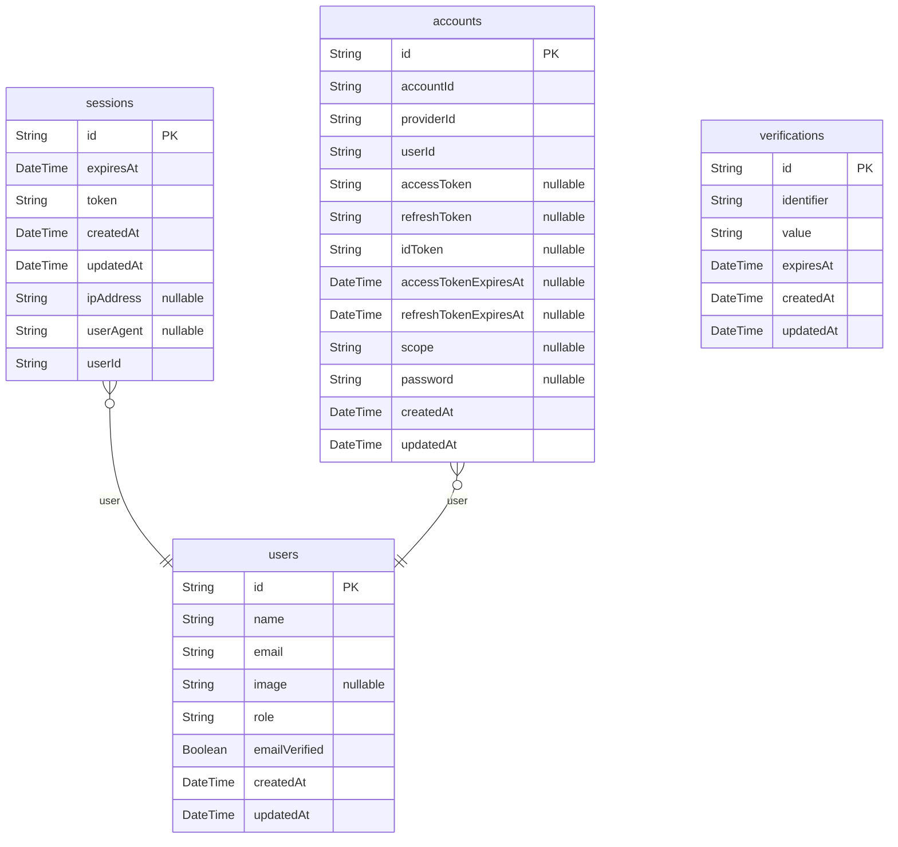

```mermaid
erDiagram

  "users" {
    String id "PK"
    String name 
    String email 
    String image "nullable"
    String role 
    Boolean emailVerified 
    DateTime createdAt 
    DateTime updatedAt 
    }
  

  "sessions" {
    String id "PK"
    DateTime expiresAt 
    String token 
    DateTime createdAt 
    DateTime updatedAt 
    String ipAddress "nullable"
    String userAgent "nullable"
    String userId 
    }
  

  "accounts" {
    String id "PK"
    String accountId 
    String providerId 
    String userId 
    String accessToken "nullable"
    String refreshToken "nullable"
    String idToken "nullable"
    DateTime accessTokenExpiresAt "nullable"
    DateTime refreshTokenExpiresAt "nullable"
    String scope "nullable"
    String password "nullable"
    DateTime createdAt 
    DateTime updatedAt 
    }
  

  "verifications" {
    String id "PK"
    String identifier 
    String value 
    DateTime expiresAt 
    DateTime createdAt 
    DateTime updatedAt 
    }
  
    "sessions" }o--|| users : "user"
    "accounts" }o--|| users : "user"
```
